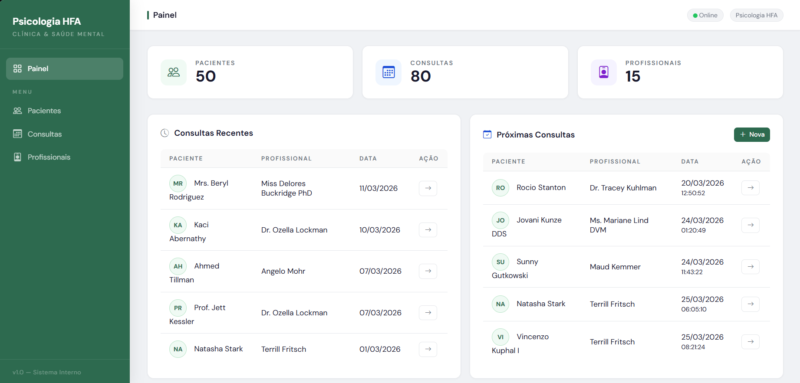
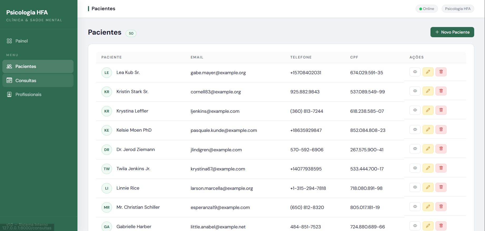
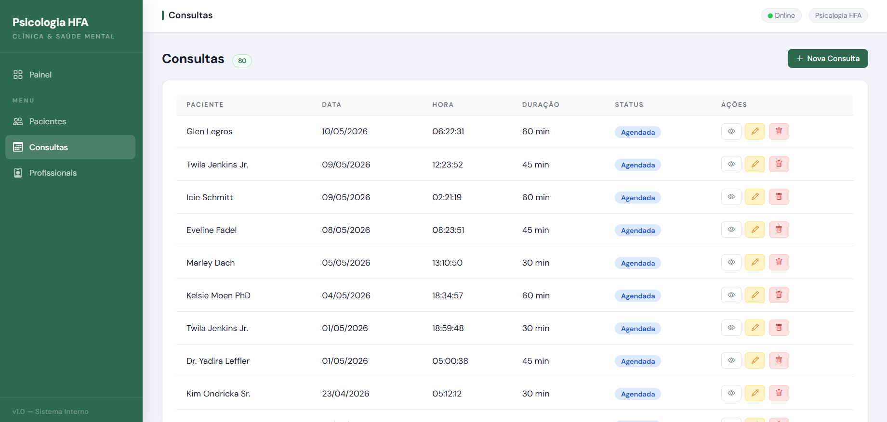
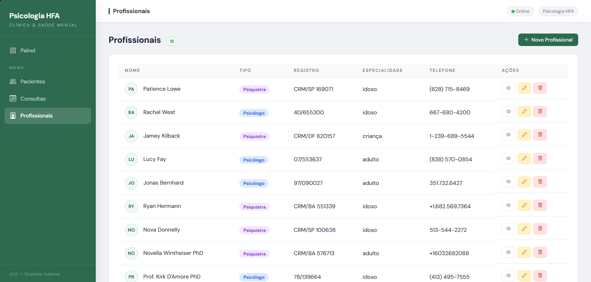

# Sistema de Gestão Clínica para a Seção de Psicologia e Psiquiatria do HFA

Sistema web desenvolvido em **Laravel** para gerenciamento interno de uma clínica de psicologia.
Permite o controle integrado de pacientes, profissionais de saúde e consultas,
com uma visão consolidada disponível no painel principal.

---

## Propósito

O sistema foi desenvolvido para centralizar e organizar os fluxos operacionais da clínica,
substituindo o controle manual por um ambiente digital estruturado.
Seu objetivo é facilitar o cadastro e acompanhamento de pacientes,
a gestão dos profissionais de saúde e o agendamento de consultas,
garantindo rastreabilidade e organização das informações clínicas.

---

## Fluxos Principais

### Pacientes
Representa os indivíduos atendidos pela clínica.
Armazena dados pessoais como nome, CPF, data de nascimento,
contato e observações clínicas relevantes.

### Profissionais
Representa os profissionais de saúde vinculados à clínica,
podendo ser **psicólogos** ou **psiquiatras**.
Cada profissional possui registro CRP ou CRM, especialidade e dados de contato.

### Consultas
Representa os atendimentos agendados ou realizados na clínica.
Uma consulta é sempre vinculada a um **paciente** e a um **profissional**,
possuindo data, horário, duração e status
(`agendada`, `realizada` ou `cancelada`).
O sistema aplica regras de expediente para validação dos horários:
- **Segunda a quinta-feira:** das 07:00 às 23:00
- **Sextas-feiras:** das 07:00 às 19:00
- **Fins de semana:** sem atendimento

---

## Painel Principal

O sistema conta com um **Dashboard** gerenciado pelo `DashboardController`,
que serve como ponto de entrada após o acesso.
Nele é possível visualizar:



- Total de pacientes, profissionais e consultas cadastrados
- Consultas recentes realizadas
- Próximas consultas agendadas
- Consultas canceladas

---

## Arquitetura do Projeto — Padrão MVC

O sistema segue o padrão arquitetural **MVC (Model-View-Controller)**,
promovendo a separação clara de responsabilidades entre as camadas da aplicação.

|                         Pacientes                          |                         Consultas                          |                           Profissionais                            |
|:----------------------------------------------------------:|:----------------------------------------------------------:|:------------------------------------------------------------------:|
|  |  |  |

---

### Models — Representação dos Dados

Localizados em `app/Models/`, os Models representam as tabelas do banco de dados
e encapsulam os relacionamentos entre as entidades.

| Model | Tabela | Descrição |
|---|---|---|
| `Paciente` | `pacientes` | Dados pessoais e clínicos dos pacientes |
| `Profissional` | `profissionais` | Dados dos psicólogos e psiquiatras |
| `Consulta` | `consultas` | Agendamentos vinculados a pacientes e profissionais |
| `User` | `users` | Usuários do sistema com acesso autenticado |

**Relacionamentos:**
- Um `Paciente` possui muitas `Consultas`
- Um `Profissional` possui muitas `Consultas`
- Uma `Consulta` pertence a um `Paciente` e a um `Profissional`

---

### 🎮 Controllers — Regras e Navegação

Localizados em `app/Http/Controllers/`, os Controllers são responsáveis por
receber as requisições, aplicar a lógica de negócio,
interagir com os Models e retornar as respostas para o usuário.

| Controller | Responsabilidade |
|---|---|
| `DashboardController` | Exibe o painel principal com totais e consultas recentes |
| `PacienteController` | Gerencia o fluxo completo de pacientes |
| `ProfissionalController` | Gerencia o fluxo completo de profissionais |
| `ConsultaController` | Gerencia o fluxo completo de consultas com regras de expediente |

Cada controller de entidade implementa os **7 métodos RESTful** padrão do Laravel:
`index`, `create`, `store`, `show`, `edit`, `update` e `destroy`.

---

### Views — Interface Gráfica

Localizadas em `resources/views/`, as interfaces foram desenvolvidas com
**Blade**, o motor de templates nativo do Laravel.

Cada entidade possui um conjunto completo de telas organizadas em sua própria pasta:
```
resources/views/
├── layouts/
│   └── app.blade.php         → Layout base com sidebar, topbar e estilos globais
├── dashboard.blade.php        → Painel principal
├── pacientes/
│   ├── index.blade.php        → Listagem de pacientes
│   ├── create.blade.php       → Formulário de cadastro
│   ├── edit.blade.php         → Formulário de edição
│   ├── show.blade.php         → Visualização do perfil
│   └── _form.blade.php        → Fragmento reutilizável de campos
├── consultas/
│   ├── index.blade.php
│   ├── create.blade.php
│   ├── edit.blade.php
│   ├── show.blade.php
│   └── _form.blade.php
└── profissionais/
    ├── index.blade.php
    ├── create.blade.php
    ├── edit.blade.php
    ├── show.blade.php
    └── _form.blade.php
```

---

## Validação de Dados — Form Requests

A lógica de validação dos formulários foi isolada em classes dedicadas,
localizadas em `app/Http/Requests/`.
Essa abordagem mantém os Controllers limpos e concentrados
apenas na navegação e lógica de negócio.

| Form Request | Utilizado em | Responsabilidade |
|---|---|---|
| `PacienteRequest` | `PacienteController` | Valida campos obrigatórios e bloqueia datas de nascimento futuras |
| `ProfissionalRequest` | `ProfissionalController` | Valida CRP e email únicos por profissional |
| `ConsultaRequest` | `ConsultaController` | Valida horários conforme expediente da clínica |

**Regras de expediente aplicadas no `ConsultaRequest`:**
```
Segunda a quinta-feira → 07:00 às 23:00
Sextas-feiras          → 07:00 às 19:00
Fins de semana         → Sem atendimento
```

Caso o horário informado esteja fora do expediente,
o sistema exibe automaticamente uma mensagem de erro no formulário,
sem que o dado seja persistido no banco.

---

## Estrutura do Banco de Dados e Relacionamentos

O banco de dados é inicializado e versionado através de **Migrations**,
localizadas em `database/migrations/`.
Cada migration representa uma operação estrutural no banco,
permitindo que o ambiente seja recriado de forma consistente
com o comando `php artisan migrate`.

### Migrations do Sistema

| Arquivo | Descrição |
|---|---|
| `create_users_table` | Tabela de usuários do sistema |
| `create_pacientes_table` | Tabela de pacientes com dados pessoais e clínicos |
| `create_consultas_table` | Tabela de consultas vinculadas a pacientes |
| `create_profissionais_table` | Tabela de profissionais de saúde |
| `add_profissional_id_to_consultas_table` | Adiciona o vínculo entre consultas e profissionais |

### Relacionamentos

O arquivo `add_profissional_id_to_consultas_table` merece destaque especial —
ele representa a evolução do banco de dados após a criação inicial,
adicionando a chave estrangeira `profissional_id` à tabela de consultas.
Isso estabelece que **toda consulta possui um vínculo com um profissional**,
refletindo diretamente a regra de negócio da clínica.
```
Paciente      ──< Consulta >── Profissional
(hasMany)         (belongsTo)     (hasMany)
```

### Seeders e Factories

O ambiente de desenvolvimento conta com **Factories** e **Seeders**
para a geração rápida de dados de teste,
localizados em `database/factories/` e `database/seeders/`.

| Classe | Descrição |
|---|---|
| `PacienteFactory` | Gera pacientes com dados fictícios para testes |
| `ProfissionalFactory` | Gera profissionais com CRP e especialidades fictícias |
| `ConsultaFactory` | Gera consultas vinculadas a pacientes e profissionais |
| `DatabaseSeeder` | Orquestra a execução de todos os seeders |

Para popular o banco com dados de teste:
```bash
php artisan db:seed
```

Ou recriar o banco do zero já com os dados:
```bash
php artisan migrate:fresh --seed
```

---

## Tecnologias, Testes e Ferramentas Auxiliares

### Tecnologias Principais

| Tecnologia | Versão | Função |
|---|---|---|
| PHP | 8.2 | Linguagem base do backend |
| Laravel | 12 | Framework principal |
| SQLite | — | Banco de dados do ambiente de desenvolvimento |
| Blade | — | Motor de templates para as views |
| Bootstrap Icons | 1.11 | Ícones da interface |
| DM Sans | — | Tipografia da interface |

### Gestão de Assets — Vite

O projeto utiliza o **Vite** como ferramenta de build para os assets do frontend,
configurado via `vite.config.js`.
O Vite é responsável por compilar e otimizar os arquivos de CSS e JavaScript,
garantindo performance e hot-reload durante o desenvolvimento.

Para compilar os assets:
```bash
# Ambiente de desenvolvimento com hot-reload
npm run dev

# Build para produção
npm run build
```

### Testes Automatizados

O projeto possui uma estrutura base para testes automatizados
gerenciada pelo **PHPUnit**, configurado via `phpunit.xml`.
```
tests/
├── Feature/
│   └── ExampleTest.php    → Testes de funcionalidades completas (HTTP, banco)
└── Unit/
    └── ExampleTest.php    → Testes de unidades isoladas de código
```

| Tipo | Descrição |
|---|---|
| **Feature Tests** | Testam fluxos completos como rotas, controllers e respostas HTTP |
| **Unit Tests** | Testam unidades isoladas como métodos de Models e regras de negócio |

Para executar os testes:
```bash
php artisan test
```

---

### Ferramentas de Desenvolvimento

| Ferramenta | Função |
|---|---|
| Composer | Gerenciador de dependências PHP |
| NPM | Gerenciador de dependências JavaScript |
| PHPStorm | IDE utilizada no desenvolvimento |
| Git | Controle de versão |
